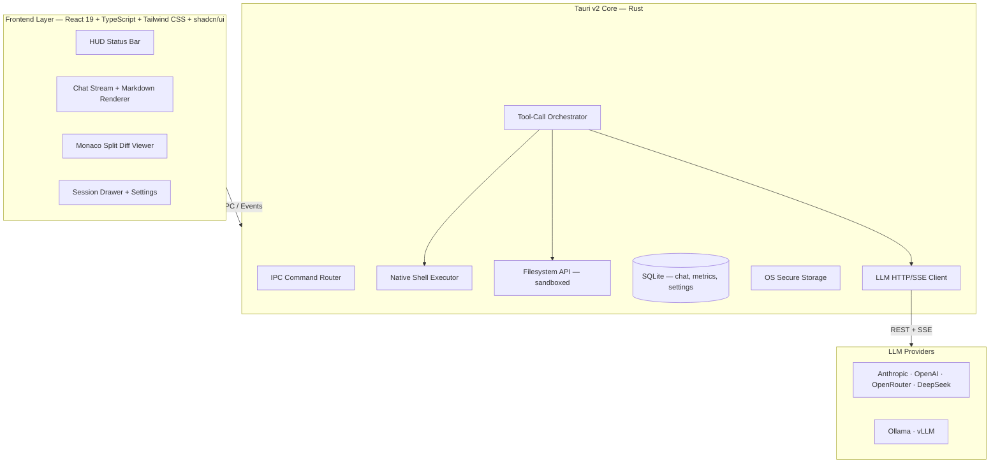

# Noir Desktop — Product Requirements Document

> **Codename:** Grace Field House Edition  
> **Version:** 2.0.0  
> **Status:** Approved for Implementation  
> **Last Updated:** 2026-08-18  
> **Stack:** Tauri v2 · React 19 · TypeScript · Tailwind CSS · shadcn/ui · SQLite · Bun

---

## 1. Executive Summary

Noir Desktop is a standalone desktop AI-agent workbench that eliminates the need for external CLI tooling (e.g., OpenCode). It provides a first-class graphical interface for operating one or more LLM-powered agents that can read, write, and execute code within a user-designated workspace — with full transparency, approval controls, and real-time telemetry.

### 1.1 Design Language

The product adopts a **Grace Field House** thematic layer — a narrative skin over core system concepts — to reinforce mental models for power users:

| Theme              | System Concept           | Description                                                                                                  |
| :----------------- | :----------------------- | :----------------------------------------------------------------------------------------------------------- |
| Agent Identification | Multi-Worker Identity    | Tactical auto/custom naming for worker instances (e.g., `NORMAN-22194`, `RAY-81194`, `EMMA-63194`).         |
| Mama's Gate        | Execution Approval Guard | Security confirmation dialog before agents execute destructive shell commands or file mutations.              |
| Intelligence Score | Metrics & Analytics      | Dashboard tracking token usage, estimated cost, latency, and tool-call success rate per agent.                |
| Escape Plan Mode   | Autonomous Execution     | Uninterrupted execution mode for sandboxed workspaces — bypasses per-action approval prompts.                |

---

## 2. Goals & Non-Goals

### 2.1 Goals

- **G1** — Zero external CLI dependency; all agent execution happens via native Tauri IPC.
- **G2** — First-class streaming UX with collapsible tool-call logs, inline code diffs, and real-time agent status.
- **G3** — Multi-provider LLM support (Anthropic, OpenAI, OpenRouter, DeepSeek, Ollama, vLLM) via direct REST/SSE.
- **G4** — Secure credential storage using OS-native keychains; workspace-scoped filesystem sandboxing.
- **G5** — Cross-platform distribution: Windows (`.exe` / `.msi`), macOS (`.dmg`), Linux (`.AppImage` / `.deb`).

### 2.2 Non-Goals

- **NG1** — Browser / web-hosted deployment.
- **NG2** — Multi-user / collaborative editing.
- **NG3** — Training or fine-tuning LLM models.
- **NG4** — Mobile platform support.

---

## 3. Functional Requirements

### 3.1 Standalone Agent Engine

| ID     | Requirement                        | Details                                                                                              |
| :----- | :--------------------------------- | :--------------------------------------------------------------------------------------------------- |
| FR-01  | Native Shell Executor              | Execute shell commands via Rust-side Tauri commands with real-time stdout/stderr streaming over IPC events. |
| FR-02  | Filesystem Operations              | `read_file`, `write_file`, `list_directory`, `create_directory`, `delete` — all scoped to the active workspace. |
| FR-03  | Direct LLM Provider Streaming      | SSE-based streaming to Anthropic, OpenAI, OpenRouter, DeepSeek, and local endpoints (Ollama / vLLM). |
| FR-04  | Tool Calling Protocol              | Implement the tool-use loop: LLM emits tool calls → engine executes → results fed back → LLM continues. |
| FR-05  | Git Integration                    | `git_diff`, `git_status`, `git_log` commands for contextual code awareness.                          |
| FR-06  | Code Search                        | Regex and literal search across workspace files with result ranking.                                 |

### 3.2 User Interface

| ID     | Requirement                        | Details                                                                                              |
| :----- | :--------------------------------- | :--------------------------------------------------------------------------------------------------- |
| FR-10  | Chat Stream                        | Markdown-rendered message stream with syntax-highlighted code blocks and streaming token display.     |
| FR-11  | Collapsible Tool Accordions        | Each tool invocation rendered as an expandable block showing raw input, output, stdout, and stderr.   |
| FR-12  | Split Diff Viewer                  | Monaco-based side-by-side diff view before the agent applies file changes; user can approve or reject. |
| FR-13  | Session Management                 | Sidebar drawer for conversation history, workspace selection, and agent configuration.                |
| FR-14  | HUD Status Bar                     | Persistent bar displaying: active LLM model, working directory, memory usage, token count, and agent state. |
| FR-15  | Agent Status Indicator             | Real-time state badge: `IDLE` · `THINKING` · `EXECUTING` · `WAITING_APPROVAL` · `ERROR`.            |

### 3.3 Approval & Security Controls

| ID     | Requirement                        | Details                                                                                              |
| :----- | :--------------------------------- | :--------------------------------------------------------------------------------------------------- |
| FR-20  | Mama's Gate Modal                  | Blocking confirmation dialog for destructive operations (file delete, arbitrary shell commands).      |
| FR-21  | Escape Plan Mode Toggle            | Per-workspace toggle to disable approval prompts; requires explicit user opt-in with warning.        |
| FR-22  | Agent Identity Registry            | Assign and persist tactical identifiers per agent worker session.                                    |

### 3.4 Data Persistence

| ID     | Requirement                        | Details                                                                                              |
| :----- | :--------------------------------- | :--------------------------------------------------------------------------------------------------- |
| FR-30  | Chat History Storage               | SQLite-backed persistence of all conversations, tool calls, and agent responses.                     |
| FR-31  | Settings & Preferences             | Persistent user preferences: theme, default model, approval mode, workspace paths.                  |
| FR-32  | Intelligence Score Tracking        | Per-session metrics: token usage, estimated cost, latency percentiles, tool-call success rate.       |

---

## 4. Technical Architecture

### 4.1 Key Architectural Decisions

| Decision                          | Rationale                                                                                  |
| :-------------------------------- | :----------------------------------------------------------------------------------------- |
| Tauri v2 over Electron            | Significantly smaller binary size (~5–10 MB vs ~150 MB); native Rust performance; OS-level security APIs. |
| SQLite over IndexedDB             | Structured relational queries for chat history and metrics; Tauri SQL plugin provides native bindings. |
| Direct SSE over WebSocket         | LLM providers use SSE natively; no protocol translation layer needed.                      |
| Monaco Editor for diffs           | Industry-standard diff rendering; same engine as VS Code; rich API for custom decorations. |
| OS Keychain for credentials       | No plaintext API keys on disk; leverages platform-native encryption (Keychain / Credential Manager / Secret Service). |
| Bun over Node.js / npm            | Significantly faster install and build times; native TypeScript execution; built-in bundler reduces toolchain complexity. |

---

## 5. Non-Functional Requirements

### 5.1 Performance

| Metric                  | Target          |
| :---------------------- | :-------------- |
| Installer binary size   | < 30 MB         |
| Idle RAM usage          | < 90 MB         |
| Cold-start to interactive | < 1.5 seconds |
| Time-to-first-token (UI render after SSE) | < 200 ms |

### 5.2 Security

| Requirement                        | Implementation                                                                            |
| :--------------------------------- | :---------------------------------------------------------------------------------------- |
| API Key Storage                    | OS-native secure storage — macOS Keychain, Windows Credential Manager, Linux Secret Service. |
| Filesystem Sandboxing              | Agent file operations restricted to user-selected workspace directory; no parent traversal. |
| Shell Execution Guard              | All shell commands routed through Mama's Gate approval unless Escape Plan Mode is active.  |
| Content Security Policy            | Tauri CSP configured to block inline scripts and restrict network to configured LLM endpoints. |

### 5.3 Compatibility

| Platform | Minimum Version   | Installer Format     |
| :------- | :---------------- | :------------------- |
| Windows  | Windows 10 (1803) | `.exe` / `.msi`      |
| macOS    | 12.0 Monterey     | `.dmg`               |
| Linux    | Ubuntu 22.04+     | `.AppImage` / `.deb` |

---

## 6. Development Milestones

### Phase 1 — Foundation

> **Objective:** Bootable Tauri v2 shell with working IPC and filesystem primitives.

- [ ] Initialize Tauri v2 project with React 19 + TypeScript frontend using Bun as the JavaScript runtime and package manager.
- [ ] Implement Rust IPC commands: `execute_bash`, `read_file`, `write_file`, `list_directory`.
- [ ] Set up SQLite database schema (sessions, messages, tool_calls, metrics).
- [ ] Integrate OS-native secure storage for API key management.

### Phase 2 — Interface & Streaming

> **Objective:** Functional chat interface with live LLM streaming and tool-call rendering.

- [ ] Build core layout: sidebar, HUD bar, chat stream panel.
- [ ] Implement SSE streaming client for Anthropic and OpenAI-compatible APIs.
- [ ] Render collapsible tool-call accordions with stdout/stderr output.
- [ ] Integrate Monaco Editor for split diff view.

### Phase 3 — Agent System & Controls

> **Objective:** Complete tool-use loop, approval controls, and agent identity system.

- [ ] Implement tool-call orchestrator (LLM → tool execution → result injection → continuation).
- [ ] Build Mama's Gate approval modal with action classification (safe / destructive / unknown).
- [ ] Add Escape Plan Mode toggle with workspace-scoped configuration.
- [ ] Implement agent identity registry and session-scoped naming.

### Phase 4 — Analytics & Polish

> **Objective:** Intelligence dashboard, metrics tracking, and UX refinement.

- [ ] Build Intelligence Score dashboard: token usage, cost estimation, latency, success rate.
- [ ] Add agent status indicators with real-time state transitions.
- [ ] Implement session management: history, search, export, workspace switching.
- [ ] Performance optimization pass (bundle size, memory, startup time).

### Phase 5 — Packaging & Distribution

> **Objective:** Production-ready installers and CI/CD pipeline.

- [ ] Configure Tauri bundler for Windows, macOS, and Linux targets.
- [ ] Set up GitHub Actions CI/CD: build, sign, and publish release artifacts.
- [ ] Auto-update integration via Tauri's built-in updater.
- [ ] Final QA pass across all target platforms.

---

## 7. Success Criteria

| Criterion                                    | Measurement                                                        |
| :------------------------------------------- | :----------------------------------------------------------------- |
| Standalone operation                         | No external CLI process required; all execution via native IPC.    |
| Multi-provider support                       | Successfully stream from ≥ 3 distinct LLM providers.              |
| Approval guard coverage                      | 100% of destructive operations intercepted by Mama's Gate.         |
| Performance targets met                      | All Section 5.1 metrics verified on reference hardware.            |
| Cross-platform installers                    | Clean install and run on Windows 10+, macOS 12+, Ubuntu 22.04+.   |

---

## 8. Open Questions & Risks

| #  | Item                                          | Status   | Notes                                                                |
| :- | :-------------------------------------------- | :------- | :------------------------------------------------------------------- |
| 1  | Token counting accuracy across providers      | Open     | Each provider tokenizes differently; may need provider-specific logic. |
| 2  | Monaco Editor bundle size impact              | Open     | Evaluate lazy-loading or lighter diff alternatives if bundle exceeds target. |
| 3  | Ollama/vLLM tool-call support maturity        | Open     | Local models may not reliably follow tool-call schemas; needs fallback handling. |
| 4  | Auto-update signing for macOS notarization    | Open     | Requires Apple Developer account and notarization workflow.          |

---

*Document maintained by the Noir Desktop engineering team.*
